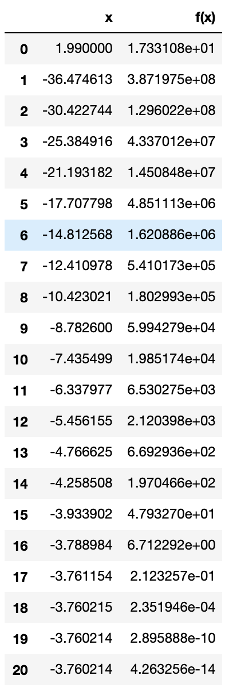

# NewtonRalphson

 

## Summary
Independent Project to implement a Newton-Ralphson one-dimension minimisation. In this project, I write my own version of Newton-Ralphson's optimization in one-dimension. While existing libraries, such as scipy, already has optimize as a method that is readily avaliable, it is good practice to write my own version to understand the concept of it.

The forumla for Newton-Ralphson's optimization is: 

# Technologies Used
* Pandas
* Python
* Jupyter Notebook

## Results
The code produced the following dataframe with custom f(x) and f'(x):

